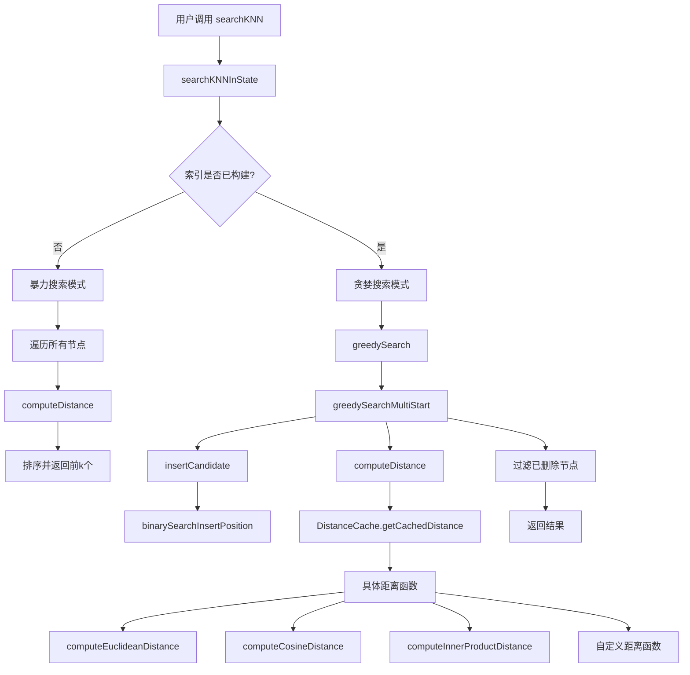

# searchKNN 调用图分析

**创建时间**: 2025-08-02 12:00:04  
**文档版本**: v1.0

## 📊 调用图概览



## 🔍 详细调用分析

### 1. 入口函数

#### `searchKNN(queryVector, k, searchParams)`
- **位置**: `src/vamana-index.ts:42`
- **功能**: 用户接口函数
- **调用**: `searchKNNInState`

### 2. 核心搜索逻辑

#### `searchKNNInState(state, queryVector, k, searchParams)`
- **位置**: `src/vamana-index.ts:315-370`
- **功能**: 核心搜索实现
- **分支逻辑**:
  - **未构建索引**: 使用暴力搜索
  - **已构建索引**: 使用贪婪搜索

### 3. 暴力搜索路径

#### 未构建索引时的处理流程:
```typescript
// 遍历所有节点
for (let i = 0; i < state.nodes.length; i++) {
  // 跳过已删除节点
  if (state.nodes[i].data.deleted) continue;
  
  // 计算距离
  const distance = computeDistance(queryArray, state.nodes[i].vector, state.distanceConfig);
  candidates.push({ id: i, distance });
}

// 排序并返回前k个
candidates.sort((a, b) => a.distance - b.distance);
return candidates.slice(0, k).map(...);
```

### 4. 贪婪搜索路径

#### `greedySearch(queryVector, startNodeId, beamSize, nodes, distanceCache, distanceConfig)`
- **位置**: `src/graph-search.ts:218`
- **功能**: 单起始点贪婪搜索
- **调用**: `greedySearchMultiStart`

#### `greedySearchMultiStart(queryVector, startNodeIds, beamSize, nodes, distanceCache, distanceConfig)`
- **位置**: `src/graph-search.ts:58`
- **功能**: 多起始点贪婪搜索（核心算法）
- **关键步骤**:
  1. 初始化候选集和访问状态
  2. 添加起始节点
  3. 主循环：扩展候选节点
  4. 探索邻居节点
  5. 维护候选集排序

### 5. 候选集管理

#### `insertCandidate(candidates, newCandidate, maxSize)`
- **位置**: `src/graph-search.ts:158`
- **功能**: 维护有序候选集
- **调用**: `binarySearchInsertPosition`

#### `binarySearchInsertPosition(candidates, distance)`
- **位置**: `src/graph-search.ts:185`
- **功能**: 二分查找插入位置
- **优化**: 使用无符号右移避免溢出

### 6. 距离计算

#### `computeDistance(vecA, vecB, config, sqNormA?, sqNormB?)`
- **位置**: `src/distance.ts:191`
- **功能**: 距离计算分发器
- **支持的距离函数**:
  - `computeEuclideanDistance`: 欧几里得距离
  - `computeCosineDistance`: 余弦距离
  - `computeInnerProductDistance`: 内积距离
  - 自定义距离函数

#### 距离缓存机制
- **类**: `DistanceCache`
- **位置**: `src/distance.ts:257`
- **功能**: LRU缓存距离计算结果
- **方法**: `getCachedDistance()`

### 7. 具体距离函数

#### `computeEuclideanDistance(vecA, vecB, sqNormA?, sqNormB?)`
- **位置**: `src/distance.ts:18`
- **优化**: 8路循环展开
- **支持**: 预计算范数优化

#### `computeCosineDistance(vecA, vecB, sqNormA?, sqNormB?)`
- **位置**: `src/distance.ts:58`
- **优化**: 8路循环展开
- **支持**: 预计算范数优化

#### `computeInnerProductDistance(vecA, vecB, config?)`
- **位置**: `src/distance.ts:138`
- **特性**: 支持内积距离预处理

## 🔄 数据流分析

### 输入数据流
1. **查询向量**: `Float32Array` 或 `number[]`
2. **搜索参数**: `SearchParams` 对象
3. **索引状态**: `VamanaState` 对象

### 中间数据流
1. **候选集**: `SearchCandidate[]` 数组
2. **访问状态**: `Uint8Array` 标记节点状态
3. **距离缓存**: `DistanceCache` 实例

### 输出数据流
1. **搜索结果**: `SearchResult[]` 数组
2. **每个结果包含**: `id`, `distance`, `data`

## ⚡ 性能优化点

### 1. 内存优化
- 使用 `Uint8Array` 替代 `Set<number>` 表示访问状态
- 对象池减少内存分配
- 复用 `visited` 数组

### 2. 计算优化
- 距离缓存避免重复计算
- 8路循环展开优化向量运算
- 预计算向量范数
- 二分查找维护候选集排序

### 3. 算法优化
- 早期终止条件
- 多起始点搜索提高连通性
- 候选集大小限制（beamSize）

## 🧪 测试覆盖

### 相关测试文件
- `tests/vamana-index.test.ts`: 基本功能测试
- `tests/vamana-search-performance.test.ts`: 搜索性能测试
- `tests/vamana-recall-performance.test.ts`: 召回率测试

### 测试场景
1. 空索引搜索
2. 未构建索引的暴力搜索
3. 已构建索引的贪婪搜索
4. 不同距离函数测试
5. 性能基准测试

## 📝 注意事项

1. **索引构建状态**: 必须调用 `buildIndex()` 后才能使用贪婪搜索
2. **节点删除**: 搜索结果会自动过滤已删除的节点
3. **距离函数**: 支持多种距离度量，需要与构建时保持一致
4. **缓存命中**: 距离缓存对性能有重要影响
5. **内存使用**: 大索引时注意内存占用

## 🔗 相关文档

- [Vamana索引实现](./vamana-index-runtime-diagram.md)
- [性能分析报告](./vamana-performance-analysis.md)
- [组件交互说明](./vamana-component-interaction.md) 