# Vamana索引组件交互图

## 🔗 组件依赖关系

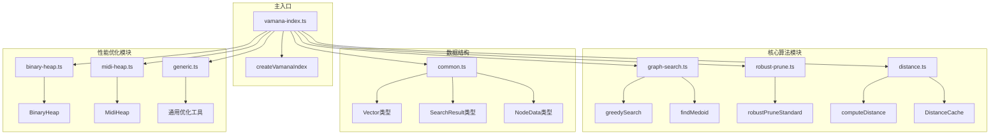

## 🔄 详细交互流程

### 1. 索引创建流程

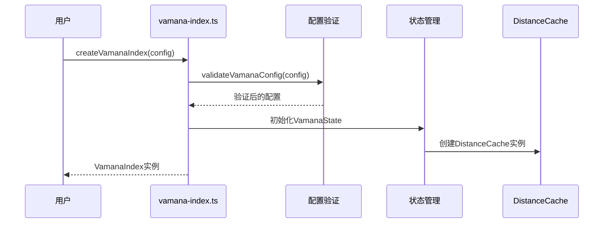

### 2. 节点插入交互

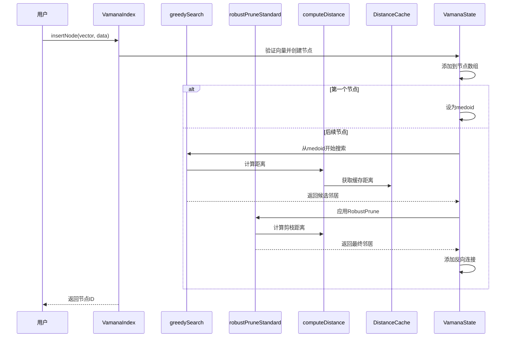

### 3. 索引构建交互

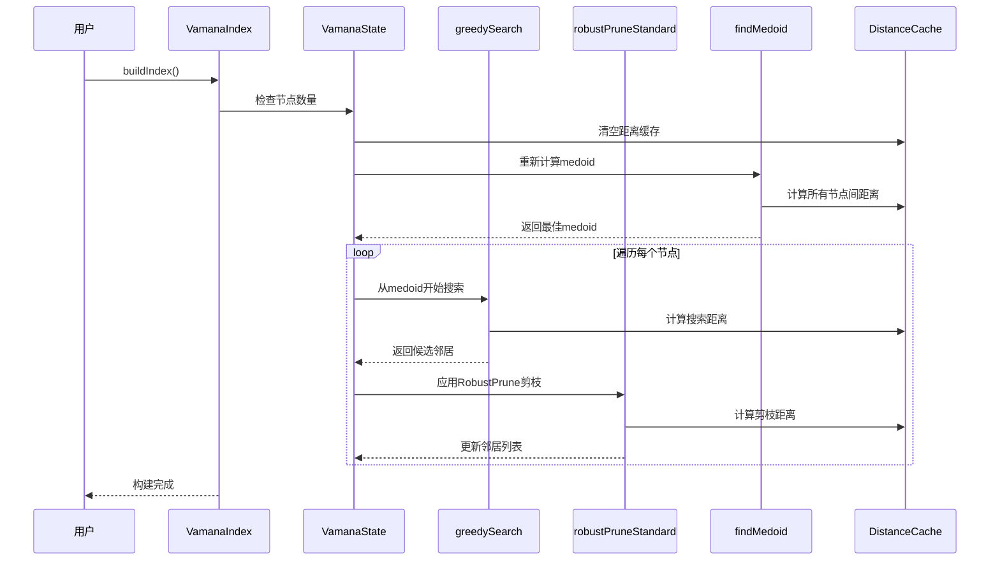

### 4. KNN搜索交互

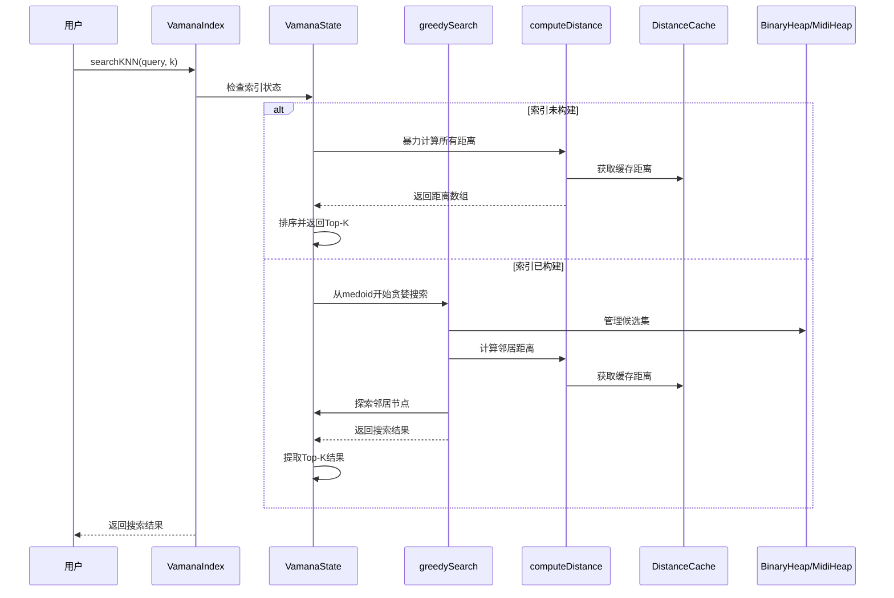

## 🏗️ 模块内部结构

### 1. vamana-index.ts 内部结构

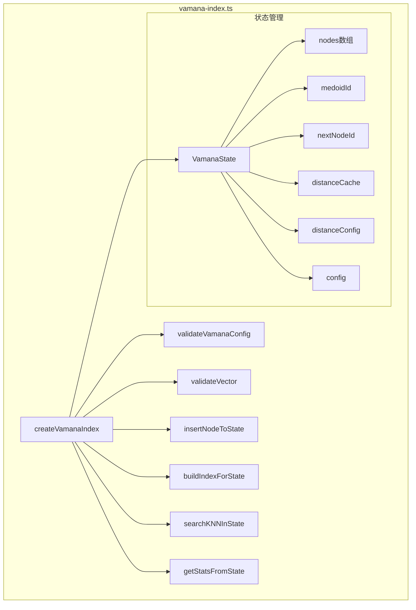

### 2. graph-search.ts 内部结构

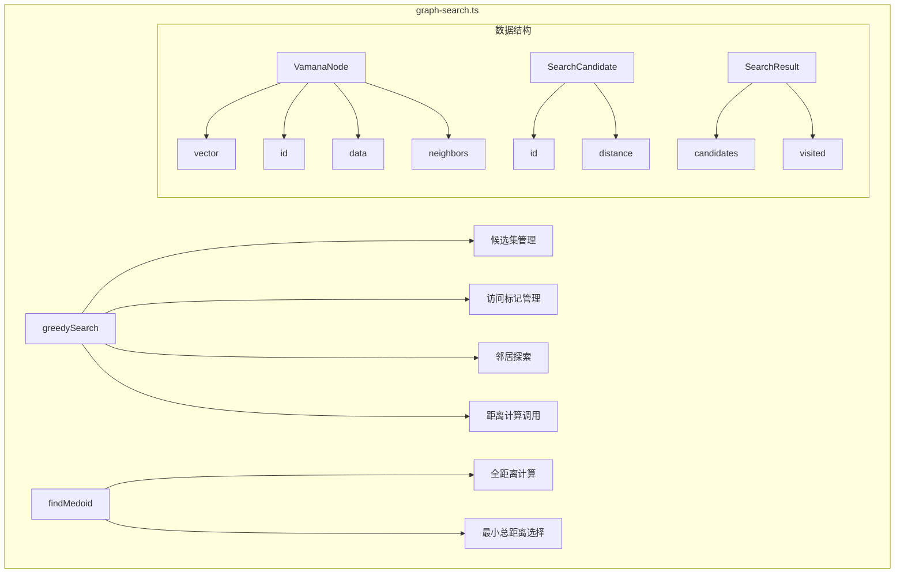

### 3. distance.ts 内部结构

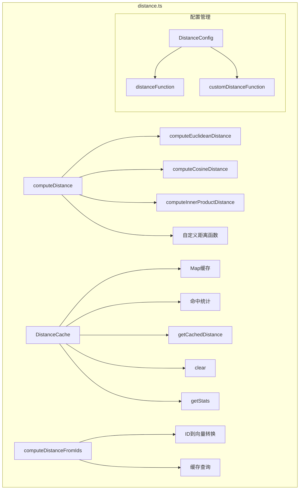

### 4. robust-prune.ts 内部结构

```mermaid
graph TB
    subgraph "robust-prune.ts"
        A[robustPruneStandard] --> B[候选集初始化]
        A --> C[贪心选择循环]
        A --> D[剪枝条件检查]
        A --> E[邻居列表构建]
        
        subgraph "算法步骤"
            F[步骤1: 初始化候选集] --> G[步骤2: 重置出边]
            G --> H[步骤3: 贪心选择]
            H --> I[步骤4: 剪枝]
            I --> J[步骤5: 循环直到满足条件]
        end
        
        subgraph "剪枝条件"
            K[α*dist(p*,p') ≤ d(p,p')] --> L[移除满足条件的候选点]
        end
    end
```

## 🔧 性能优化交互

### 1. 距离缓存交互

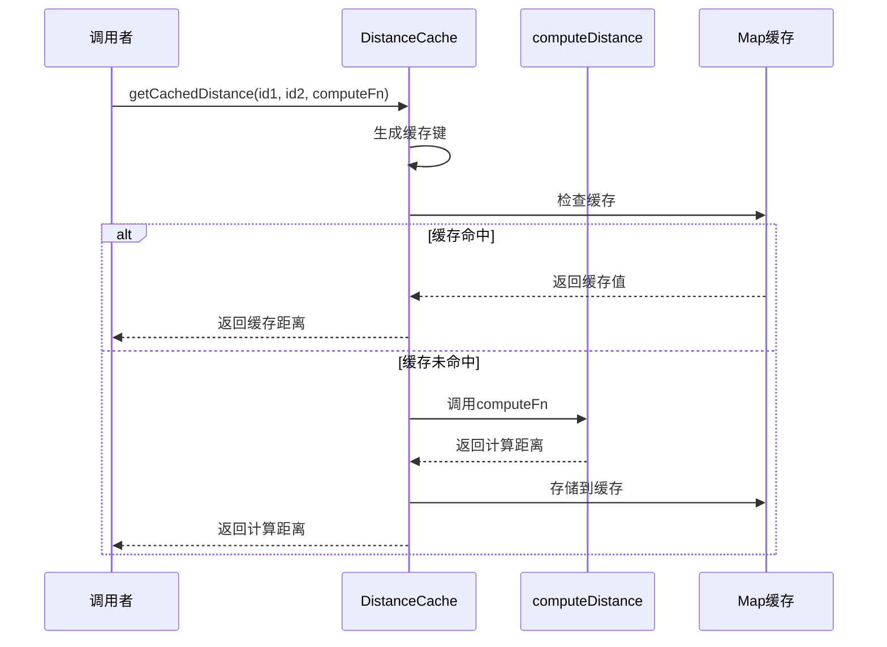

### 2. 堆优化交互

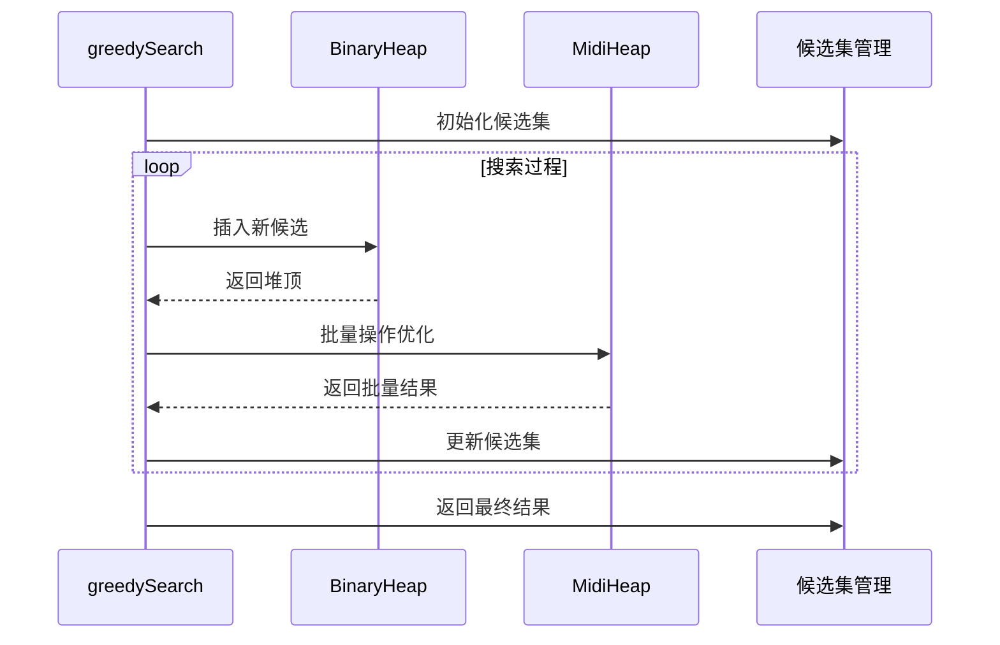

## 📊 数据流图

### 1. 向量数据流


### 2. 距离计算数据流

```mermaid
graph TB
    A[向量对] --> B[距离函数选择]
    B --> C[具体距离计算]
    C --> D[距离缓存检查]
    D --> E[缓存存储/获取]
    E --> F[距离值返回]
    
    subgraph "距离类型"
        G[欧几里得] --> H[sqrt(sum(diff²))]
        I[余弦] --> J[1 - dot/(normA*normB)]
        K[内积] --> L[-sum(a*b)]
    end
    
    C --> G
    C --> I
    C --> K
```

### 3. 搜索数据流

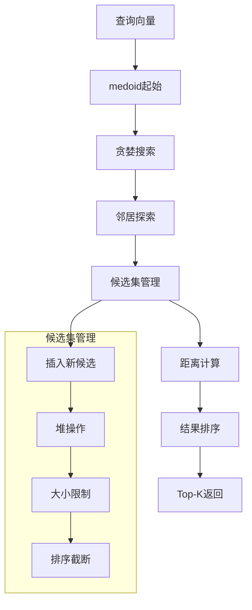

## 🎯 关键交互点

### 1. 性能瓶颈点

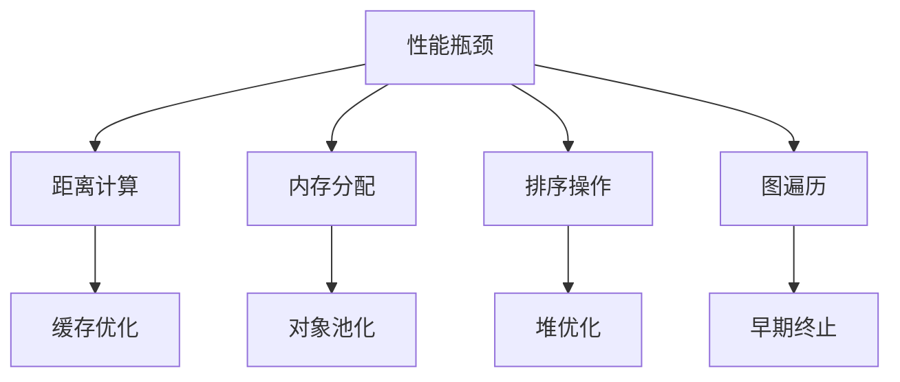

### 2. 优化策略交互

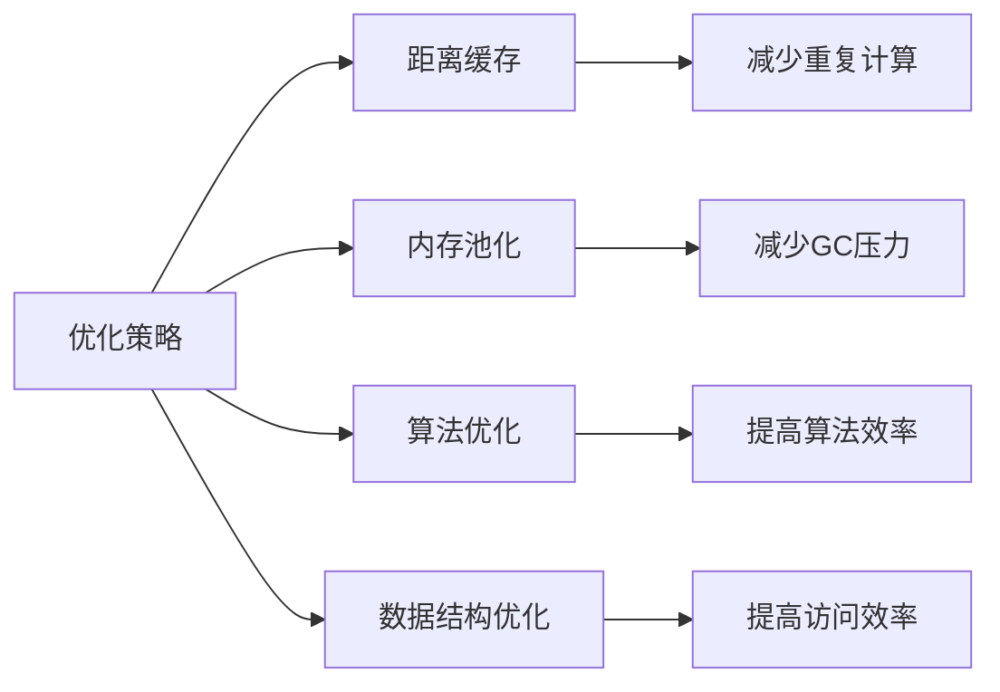

---

*最后更新时间: 2025-08-02 06:20:52* 