# Vamana索引运行图

## 📊 整体架构图

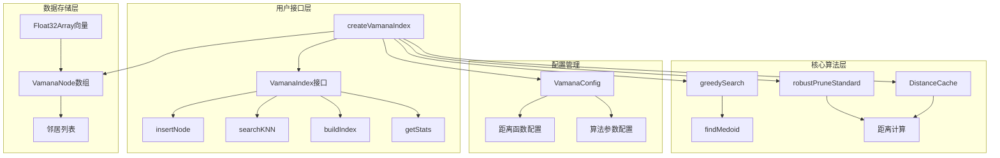

## 🔄 主要运行流程

### 1. 索引构建流程 (buildIndex)

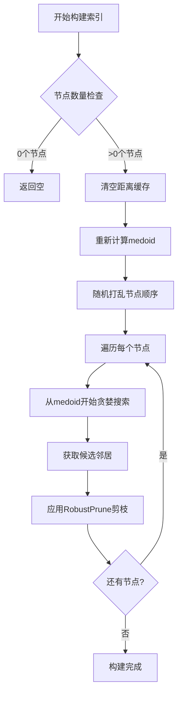

### 2. 节点插入流程 (insertNode)

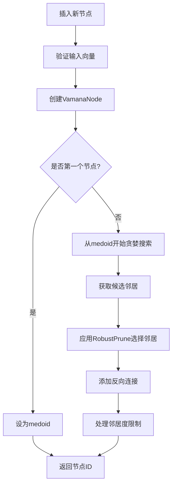

### 3. 搜索流程 (searchKNN)

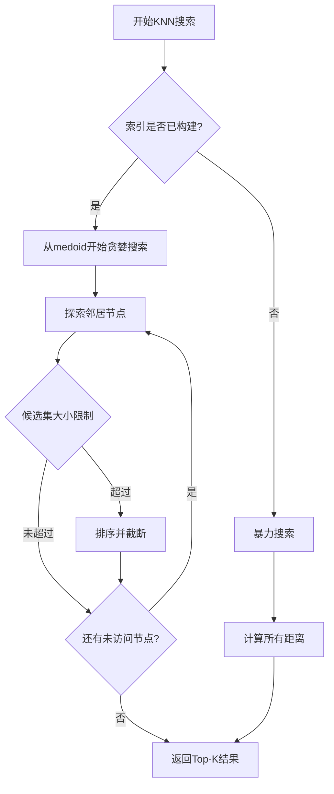

### 4. RobustPrune剪枝算法

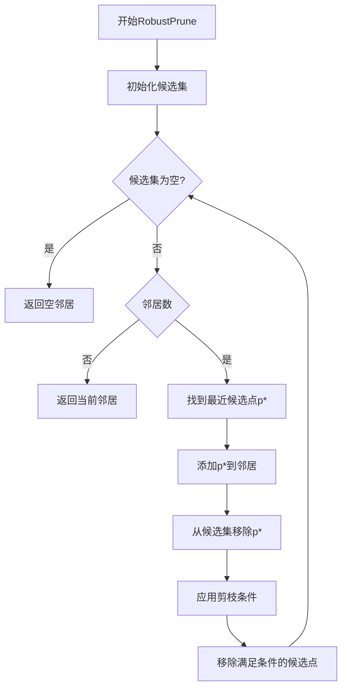

## 🏗️ 核心组件关系

### 距离计算组件

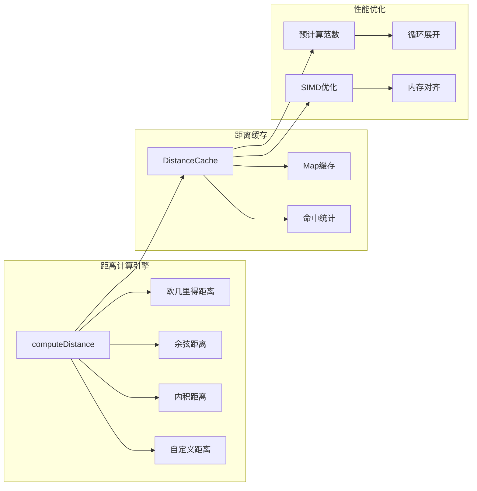

### 图搜索组件

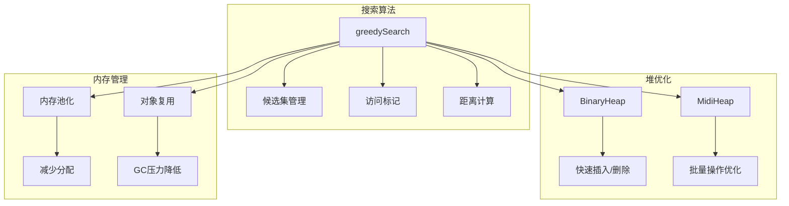

## ⚡ 性能优化策略

### 1. 距离计算优化

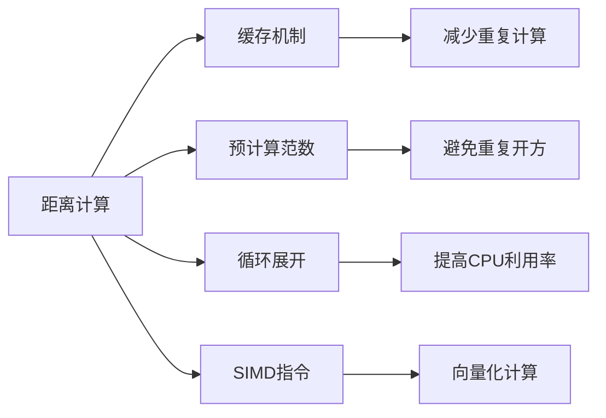

### 2. 内存管理优化

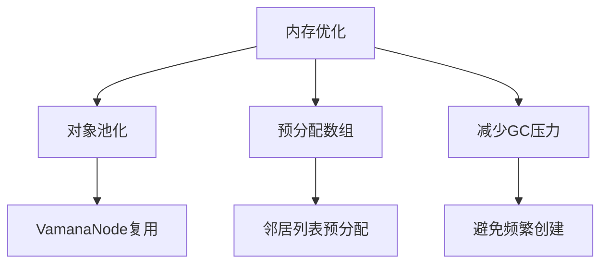

### 3. 算法优化

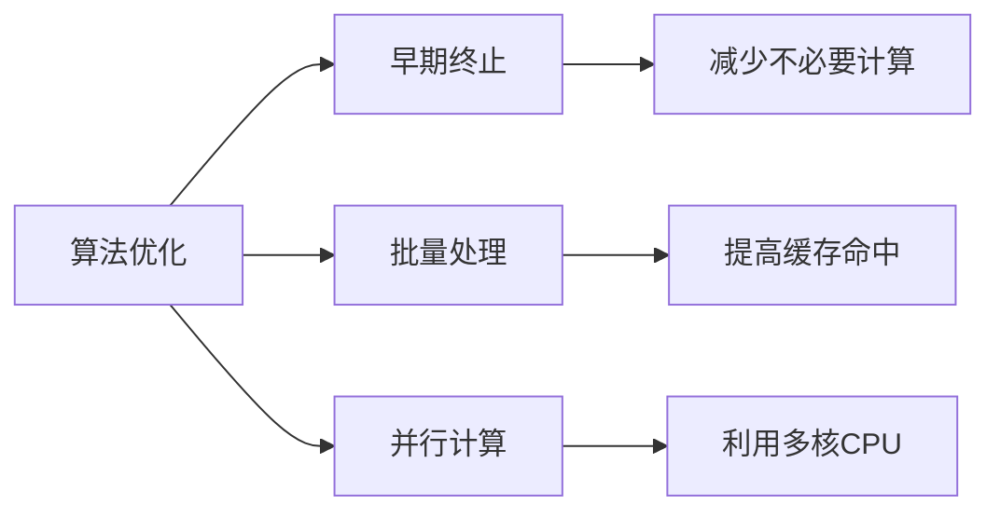

## 📈 性能指标

### 时间复杂度分析

| 操作 | 平均复杂度 | 最坏复杂度 | 优化策略 |
|------|------------|------------|----------|
| 插入节点 | O(L log L) | O(n²) | 距离缓存 |
| 构建索引 | O(nL log L) | O(n³) | 批量处理 |
| KNN搜索 | O(log n) | O(n) | 图结构优化 |
| 距离计算 | O(d) | O(d) | SIMD优化 |

### 空间复杂度分析

| 组件 | 空间复杂度 | 优化策略 |
|------|------------|----------|
| 节点存储 | O(nd) | 内存池化 |
| 邻居列表 | O(nR) | 预分配 |
| 距离缓存 | O(n²) | LRU淘汰 |
| 搜索状态 | O(L) | 对象复用 |

## 🔧 配置参数影响

### 关键参数说明

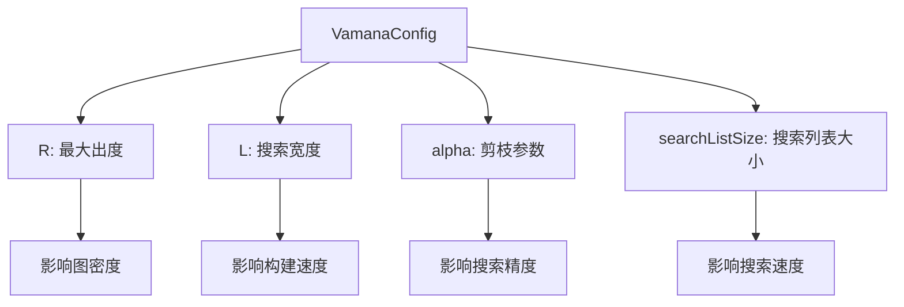

### 参数调优建议

| 场景 | R | L | alpha | searchListSize |
|------|---|---|-------|----------------|
| 高精度 | 64 | 128 | 1.0 | 200 |
| 高速度 | 16 | 32 | 1.5 | 50 |
| 平衡 | 32 | 64 | 1.2 | 100 |
| 内存受限 | 8 | 16 | 1.8 | 25 |

## 🚀 使用示例

### 基本使用流程

```typescript
// 1. 创建索引
const index = createVamanaIndex({
  distanceFunction: 'euclidean',
  R: 32,
  L: 64,
  alpha: 1.2
});

// 2. 插入数据
const vectors = [
  new Float32Array([1, 0, 0]),
  new Float32Array([0, 1, 0]),
  new Float32Array([0, 0, 1])
];

vectors.forEach((vector, i) => {
  index.insertNode(vector, { id: i });
});

// 3. 构建索引
index.buildIndex();

// 4. 搜索
const query = new Float32Array([0.5, 0.5, 0]);
const results = index.searchKNN(query, 5);

// 5. 获取统计信息
const stats = index.getStats();
```

## 📊 监控指标

### 运行时监控

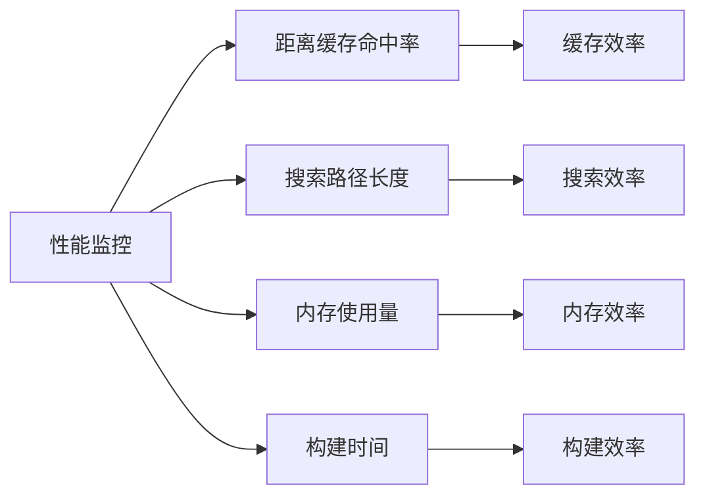

### 关键指标

- **距离缓存命中率**: 目标 > 80%
- **平均搜索路径长度**: 目标 < log(n)
- **内存使用量**: 监控增长趋势
- **构建时间**: 与数据量线性关系

---

*最后更新时间: 2025-08-02 06:20:52* 