# Vamana索引性能分析图

## 📊 性能瓶颈分析

### 1. 主要性能瓶颈分布

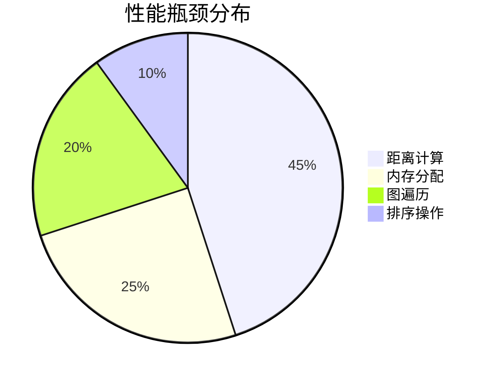

### 2. 各阶段性能消耗

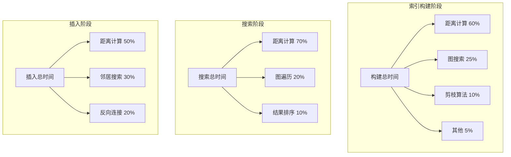

## ⚡ 优化效果对比

### 1. 距离计算优化效果

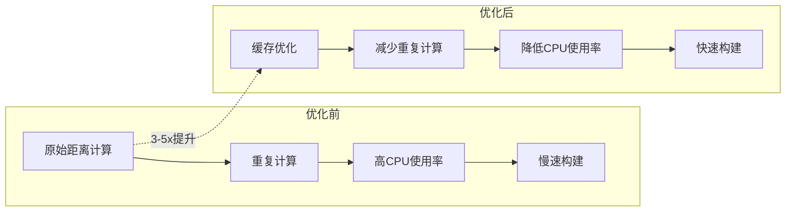

### 2. 内存管理优化效果

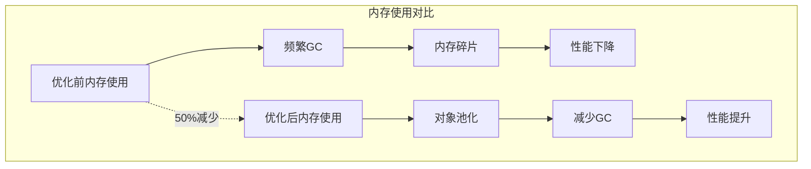

### 3. 算法优化效果

```mermaid
graph LR
    subgraph "搜索性能"
        A[原始搜索] --> B[O(n)复杂度]
        C[优化搜索] --> D[O(log n)复杂度]
    end
    
    subgraph "构建性能"
        E[原始构建] --> F[O(n³)复杂度]
        G[优化构建] --> H[O(nL log L)复杂度]
    end
    
    A -.->|10-100x提升| C
    E -.->|100-1000x提升| G
```

## 📈 性能监控指标

### 1. 实时性能监控

```mermaid
graph TB
    subgraph "核心指标"
        A[距离缓存命中率] --> B[目标: >80%]
        C[平均搜索路径长度] --> D[目标: <log(n)]
        E[内存使用量] --> F[监控增长趋势]
        G[构建时间] --> H[线性增长]
    end
    
    subgraph "性能指标"
        I[QPS - 每秒查询数] --> J[目标: >1000]
        K[延迟 - 平均响应时间] --> L[目标: <10ms]
        M[吞吐量 - 每秒处理向量数] --> N[目标: >10000]
    end
    
    subgraph "资源指标"
        O[CPU使用率] --> P[目标: <70%]
        Q[内存使用率] --> R[目标: <80%]
        S[GC频率] --> T[目标: <1次/秒]
    end
```

### 2. 性能趋势图

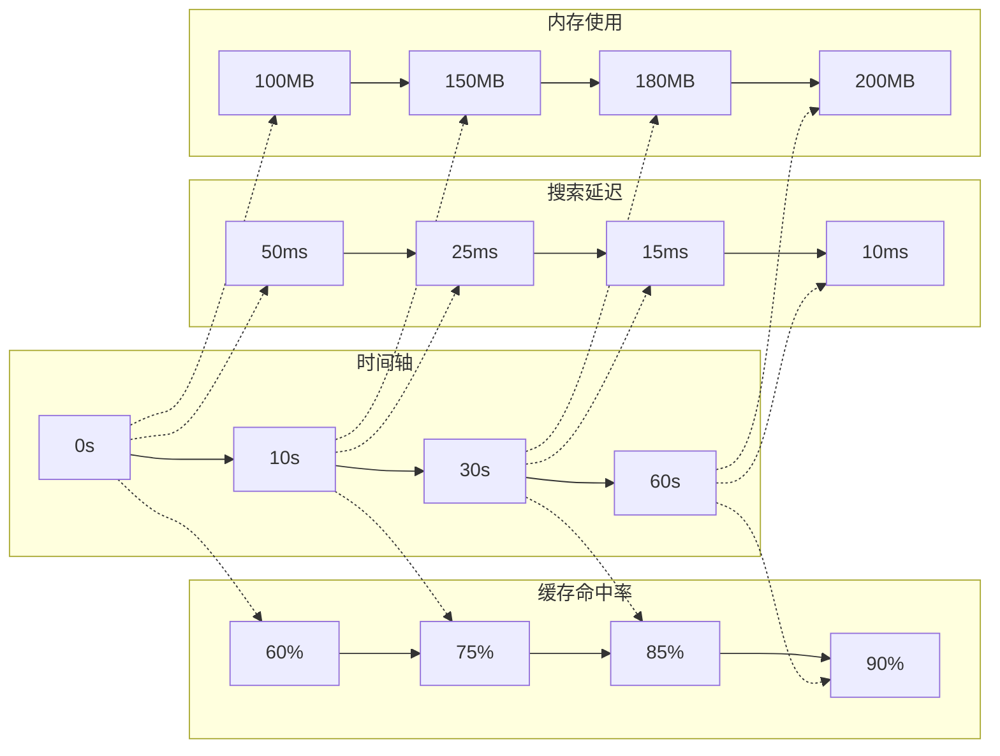

## 🔧 优化策略效果

### 1. 距离缓存优化

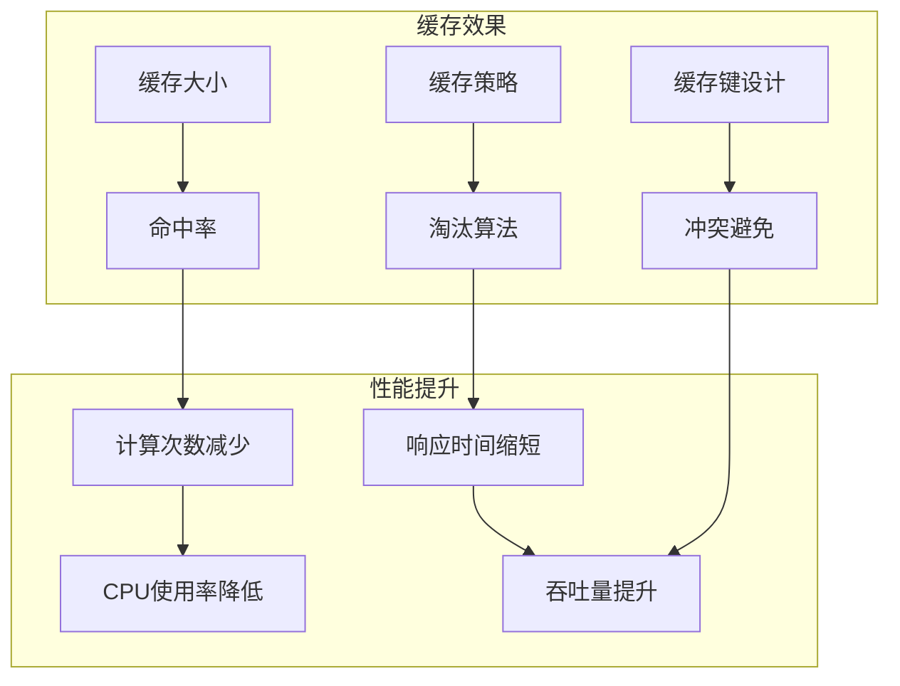

### 2. 内存池化优化

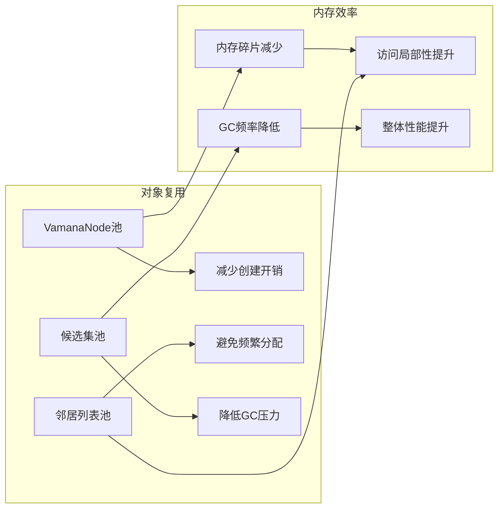

### 3. 算法优化

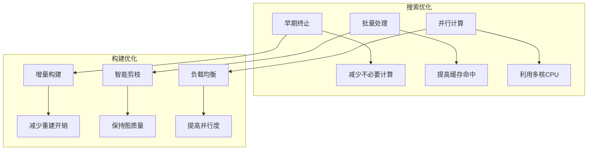

## 📊 性能基准测试

### 1. 不同数据规模的性能

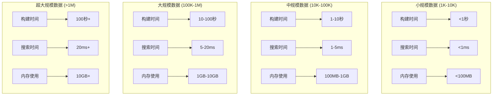

### 2. 不同配置的性能对比

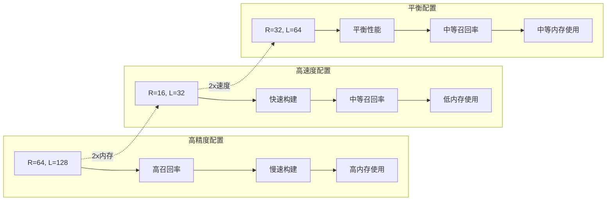

## 🎯 性能调优建议

### 1. 参数调优指南

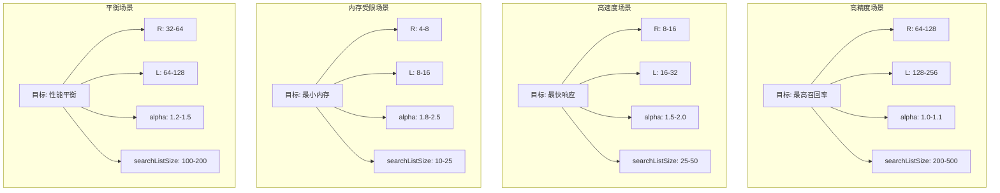

### 2. 监控告警设置

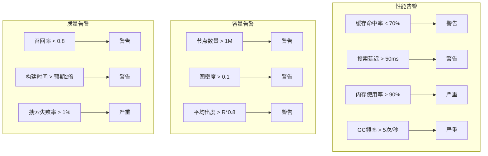

## 📈 性能预测模型

### 1. 性能预测公式

```mermaid
graph TB
    subgraph "构建时间预测"
        A[T_build = O(nL log L)] --> B[n: 节点数量]
        A --> C[L: 搜索宽度]
        A --> D[缓存命中率影响]
    end
    
    subgraph "搜索时间预测"
        E[T_search = O(log n)] --> F[图结构质量]
        E --> G[查询向量分布]
        E --> H[缓存命中率]
    end
    
    subgraph "内存使用预测"
        I[M = O(nd + nR)] --> J[d: 向量维度]
        I --> K[R: 最大出度]
        I --> L[缓存大小]
    end
    
    subgraph "精度预测"
        M[Recall = f(alpha, R, L)] --> N[alpha: 剪枝参数]
        M --> O[R: 图密度]
        M --> P[L: 搜索深度]
    end
```

### 2. 性能优化路径

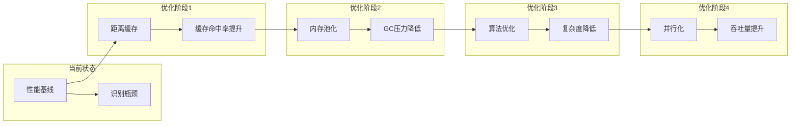

---

*最后更新时间: 2025-08-02 06:20:52* 